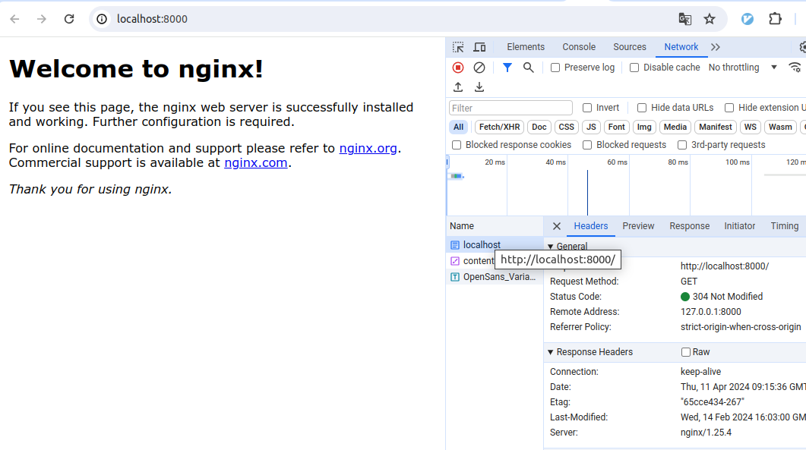

# My first acquaintance with terraform

https://developer.hashicorp.com/terraform/tutorials/docker-get-started/install-cli



## Commands

```bash
terraform init
```

```bash
terraform apply
```

```bash
terraform apply -var "container_name=YetAnotherName"
```

```bash
terraform show
```

```bash
terraform destroy
```

```bash
terraform output
```

privat.tfvars

```txt
# must be an absolute path
host_path = "/xxx/xxx/dev666/public/index.html"
```

## NO-Tutorial

Для создания локального кластера Kubernetes с использованием Terraform вы можете воспользоваться инструментами, такими как Minikube или Kind (Kubernetes in Docker).

Вот пример создания кластера Kubernetes с помощью Terraform и Kind:

1. Установите Terraform, [Kind](https://kind.sigs.k8s.io/) и Docker, если у вас их еще нет.
2. Создайте файл main.tf для конфигурации Terraform:

`main.tf`

```tf
provider "local" {}

resource "null_resource" "create_cluster" {
  provisioner "local-exec" {
    command = "kind create cluster --config=kind-config.yaml"
  }
}

resource "null_resource" "configure_kubectl" {
  depends_on = [null_resource.create_cluster]

  provisioner "local-exec" {
    command = "kind get kubeconfig --name=kind > kubeconfig"
  }
}
```

3. Создайте файл kind-config.yaml для настройки кластера Kind:

`kind-config.yaml`

```yaml
kind: Cluster
apiVersion: kind.x-k8s.io/v1alpha4
nodes:
- role: control-plane
```

4. Используйте команду terraform init, чтобы инициализировать Terraform.
5. Запустите terraform apply, чтобы создать кластер Kubernetes локально.

После выполнения этих шагов у вас будет локальный кластер Kubernetes, который вы можете использовать для разработки, тестирования и обучения.

Обратите внимание, что это только пример, и вам может потребоваться дополнительная настройка в зависимости от ваших потребностей. Кроме того, убедитесь, что ваша система поддерживает выполнение контейнеров Docker, так как Kind использует Docker для запуска узлов кластера Kubernetes.